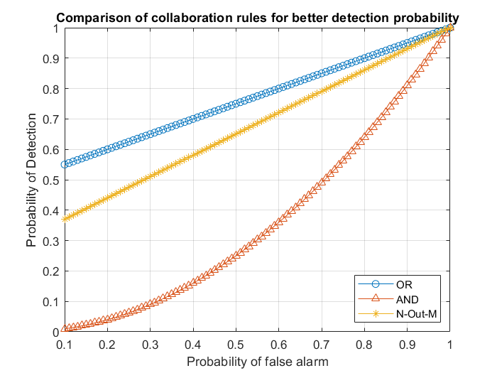
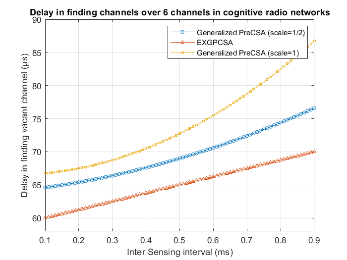
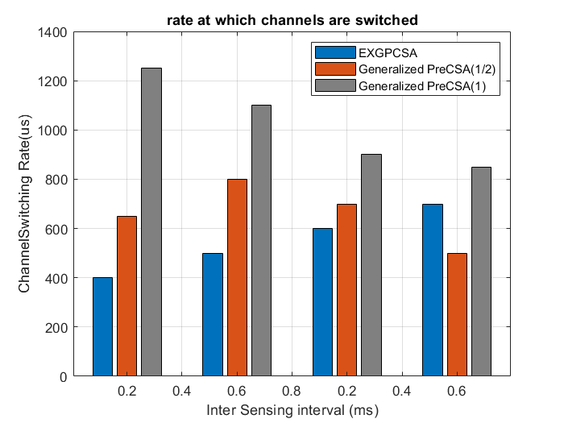
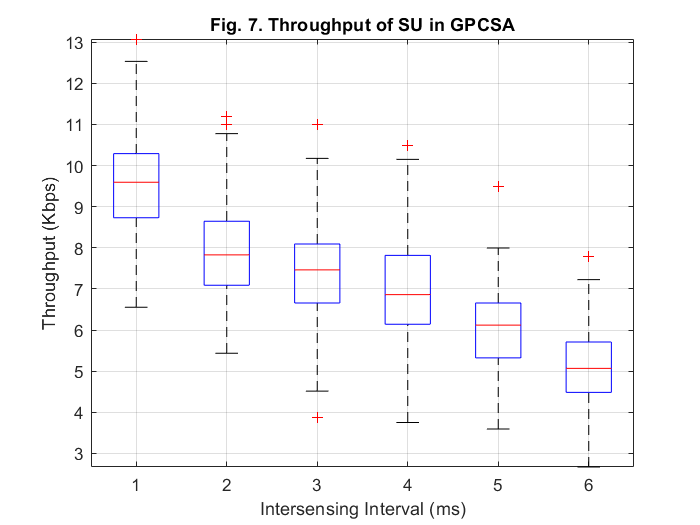
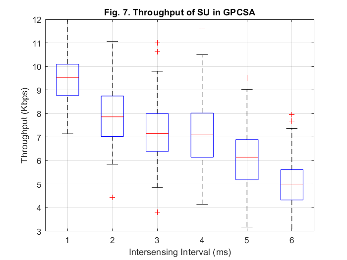

# RIS-Assisted 6G Wireless Communications: Statistical Framework Implementation

This repository contains the full numerical and statistical reimplementation of the RIS-Assisted 6G Wireless Communication framework in the presence of a direct channel.

The project validates analytical expressions using numerical simulation and demonstrates stability across varying system parameters.

---

## 📌 Overview

The composite channel consists of:

- Direct channel component  
- RIS-assisted reflected component  
- Statistical modeling under Nakagami-m fading  
- Parameter variations for m₁, m₂ and RIS elements N  

Analytical PDFs are validated against Monte Carlo simulations.

---

# 📊 Results

### 🔹 Figure 1: Composite Channel PDF

<p align="center">
  
</p>

---

### 🔹 Figure 2: Envelope PDF

<p align="center">
  
</p>

---

### 🔹 Figure 3: Channel Switching / Statistical Variation

<p align="center">
  
</p>

---

### 🔹 Figure 4: Throughput Analysis (N = 32)

<p align="center">
  
</p>

---

### 🔹 Figure 5: Throughput Analysis (N = 64)

<p align="center">
  
</p>

---

## 🧠 Methodology

- Composite channel modeling with RIS + Direct link  
- Nakagami-m fading parameters (m₁, m₂)  
- Variation of RIS elements (N = 32, 64)  
- Closed-form PDF derivation  
- Monte Carlo simulation validation  

---

## ▶️ How to Run

Python scripts included:

- `figure_2.py`
- `fig3.python.py`
- `fig4_a,b.py`

Run using:

```bash
python figure_2.py
```

---

## 👨‍🔬 Author

**Ogiboyina Jaya Pradyumna Kumar Yadav**  
National Institute of Technology Delhi  

Research Area:  
RIS-Assisted 6G Systems • Statistical Channel Modeling • Digital Twin Integration  

---

This repository is intended for academic and research purposes.
